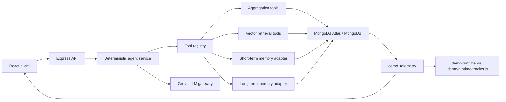

# Telco AI Analytics Agent

`telco-ai-analytics-agent` is a standalone MongoDB demo repo for a Telco-facing leadership analytics story. It answers natural-language telecom questions with deterministic tool routing, MongoDB aggregations, Atlas Vector Search with client-side Voyage embeddings, short-term memory, long-term memory, and explainable telemetry.

## What this demo shows

- MongoDB Atlas as the operational store for accounts, usage metrics, support interactions, incidents, checkpoints, memories, and telemetry.
- Aggregation Framework for churn-risk analytics and month-over-month comparison.
- Atlas Vector Search with **client-side Voyage embeddings** stored on documents for support notes, incident summaries, and durable memory retrieval.
- MCP-style controlled tools instead of free-form database access.
- Short-term memory persisted in MongoDB for follow-up resolution such as "Now compare that to last month."
- Long-term memory persisted in MongoDB for cross-session preferences such as leadership priorities.
- **Grove** for the final narrative layer. Facts always come from MongoDB first; the LLM never invents metrics.
- `.demo/` integration so a separate runtime wrapper such as `demo-runtime` can launch and observe this repo.

## Architecture



## Repo layout

```text
telco-ai-analytics-agent/
  server/
  client/
  .demo/
```

The server owns the analytics, memory, and telemetry contracts. The client is a simple React UI for the demo story. The hidden `.demo/` folder contains runtime-wrapper integration assets so the customer-facing repo can stay clean.

## Setup

1. Copy `.env.example` to `.env`.
2. Set `MONGODB_URI`, `GROVE_API_KEY`, and `VOYAGE_API_KEY`.
3. Run `npm install`.
4. Run `npm run seed` (embeds support interactions and incident summaries with Voyage).
5. Create the three Vector Search indexes in Atlas from the JSON definitions under `server/src/mongo/vectorIndexes/`.
6. Run `npm run dev`.
7. Open `http://localhost:5174`.

## Environment variables

- `MONGODB_URI`
- `MONGODB_DB_NAME=telco_ai_analytics_demo`
- `GROVE_API_KEY` (required for user-facing answers)
- `GROVE_MODEL` (defaults to `gpt-5.5`)
- `GROVE_API_URL` — canonical Grove responses endpoint (`GROVE_BASE_URL` accepted as alias in this repo only)
- `VOYAGE_API_KEY` (required for real semantic retrieval; listed in the runtime manifest)
- `VOYAGE_EMBEDDING_MODEL` (defaults to `voyage-3.5-lite` in this repo)
- `VOYAGE_EMBEDDING_DIMENSIONS` (defaults to `1024`)
- `PORT=4001`
- `CLIENT_PORT=5174`
- `CLIENT_ORIGIN=http://localhost:5174`
- `ENABLE_SHORT_TERM_MEMORY=true`
- `ENABLE_LONG_TERM_MEMORY=true`
- `MEMORY_NAMESPACE=telco-demo`
- `DEMO_RUNTIME_URL=http://localhost:4000`

References: [Create Vector Search Index](https://www.mongodb.com/docs/atlas/atlas-vector-search/create-index/), [MongoDB LangGraph.js integration docs](https://www.mongodb.com/docs/atlas/ai-integrations/langgraph-js/build-agents/).

## Data model

Database: `telco_ai_analytics_demo`

Collections:

- `accounts`
- `usage_metrics`
- `support_interactions`
- `incident_summaries`
- `agent_checkpoints`
- `agent_memories`
- `demo_telemetry`

The seed step generates:

- 72 accounts
- 18 months of usage metrics per account
- 492 support interactions (embedded with Voyage when `VOYAGE_API_KEY` is set)
- 96 incident summaries (embedded with Voyage when `VOYAGE_API_KEY` is set)

Texas enterprise accounts are intentionally overrepresented in higher-risk scenarios, and the latest two months are shaped so billing disputes, NPS drops, and network incidents form a clear leadership story instead of just random noise.

## Indexes

Standard indexes are created by `npm run indexes`:

- `accounts`: `{ region: 1, segment: 1 }`
- `accounts`: `{ accountId: 1 }` unique
- `usage_metrics`: `{ accountId: 1, month: -1 }`
- `usage_metrics`: `{ region: 1, segment: 1, month: -1 }`
- `support_interactions`: `{ accountId: 1, createdAt: -1 }`
- `incident_summaries`: `{ region: 1, createdAt: -1 }`
- `agent_checkpoints`: `{ conversationId: 1, updatedAt: -1 }`
- `agent_memories`: `{ namespace: 1, key: 1 }`
- `demo_telemetry`: `{ timestamp: -1 }`

Vector Search index definitions live in:

- [support_interactions_vector_index.json](./server/src/mongo/vectorIndexes/support_interactions_vector_index.json)
- [incident_summaries_vector_index.json](./server/src/mongo/vectorIndexes/incident_summaries_vector_index.json)
- [agent_memories_vector_index.json](./server/src/mongo/vectorIndexes/agent_memories_vector_index.json)

Create those indexes in Atlas Search / Vector Search using the JSON definitions. These are **bring-your-own-vector** indexes on the `embedding` field populated by Voyage at seed time.

## Embeddings and retrieval modes

- **Primary path:** Voyage generates embeddings at seed and query time; vectors are stored on documents and queried with `$vectorSearch` (`retrievalMode: vector`).
- **Local smoke test only:** when Voyage is unavailable, the app uses deterministic **mock embeddings** (`mock_embedding_local_only`). This is not real semantic retrieval and should not be used to evaluate search quality. **Do not use `mock_embedding_local_only` in customer demos.**
- **Degraded retrieval:** if vector search fails or returns no matches, evidence tools fall back to token overlap scoring (`lexical_degraded`).

## Short-term memory

Short-term memory stores conversation checkpoints in `agent_checkpoints`. The service records:

- user message
- assistant answer
- tool calls made
- resolved context such as region, segment, and month

When the user says "Now compare that to last month," the agent resolves `that` from the latest saved context.

Implementation note:

- The code uses a clean `MongoShortTermMemoryAdapter`.
- This adapter is designed to be replaceable with official LangGraph.js MongoDB checkpointing if you want to deepen the LangGraph integration later.

## Long-term memory

Long-term memory stores durable preferences in `agent_memories`. Example:

- Leadership cares most about billing disputes
- Leadership cares most about NPS drops
- Leadership cares most about network incidents

Memories are stored by namespace, such as `["user", "demo-user"]`, embedded with Voyage, and searched semantically through Atlas Vector Search on `memoryText`.

Implementation note:

- The code uses a `MongoLongTermMemoryAdapter`.
- This adapter is designed to be replaceable with official LangGraph.js store integrations as those APIs mature or if you choose to adopt them directly.

## Grove usage

The agent uses Grove only for the final narrative layer. Tool routing and metric computation remain deterministic. If Grove is unavailable, chat requests fail fast with a clear configuration error.

## What did we run?

Every MongoDB-backed tool operation is wrapped with telemetry and stored in `demo_telemetry`.

Each telemetry record can include:

- action name
- tool name
- database
- collection
- operation
- query or aggregation pipeline
- duration
- explain summary when available
- Grove model
- embedding model / retrieval mode
- memory metadata

The UI renders those results in the "What did we run?" panel, and the API exposes them at `GET /api/demo/actions`.

## API

- `GET /health`
- `POST /api/chat`
- `GET /api/analytics/churn-risk`
- `GET /api/analytics/churn-risk/compare`
- `GET /api/memory`
- `POST /api/memory`
- `DELETE /api/memory`
- `GET /api/demo/actions`
- `POST /api/demo/reset`
- `POST /api/demo/seed`

## Demo talk track

1. Ask: `Show churn risk for Texas enterprise accounts`
2. Show aggregation metrics for average churn risk, revenue at risk, NPS, and top drivers.
3. Show retrieved Vector Search context from support notes and incident summaries.
4. Ask: `Now compare that to last month`
5. Show short-term memory resolving `that` to Texas enterprise churn risk.
6. Ask: `Remember leadership cares most about billing disputes, NPS drops, and network incidents`
7. Start a new conversation.
8. Ask: `Analyze Texas enterprise churn risk again`
9. Show the long-term memory being retrieved and reflected in the answer emphasis.
10. Open "What did we run?" to show the aggregation pipeline, vector retrieval, memory operations, and telemetry.

## Runtime integration

The hidden `.demo/` folder contains:

- `manifest.json`
- `setup.sh`
- `seed.sh`
- `start.sh`
- `reset.sh`
- `actions.json`
- `runtime-tracker.js`

That allows a runtime wrapper such as `demo-runtime` to treat this repo as a clean standalone demo while still launching it, seeding it, resetting it, and displaying its telemetry.

If you want to share a customer-facing version later, the `.demo/` folder is intentionally isolated so it can be removed cleanly.
